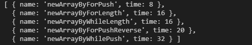
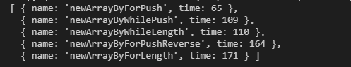

### Speed Test for create Array

- #### 5,0000

``` js
  let fpr = newArrayByForPushReverse(5e4)
  let wp = newArrayByWhilePush(5e4)
  let fp = newArrayByForPush(5e4)
  let fl = newArrayByForLength(5e4)
  let wl = newArrayByWhileLength(5e4)
```



- #### 50,0000

``` js
  let fpr = newArrayByForPushReverse(5e5)
  let wp = newArrayByWhilePush(5e5)
  let fp = newArrayByForPush(5e5)
  let fl = newArrayByForLength(5e5)
  let wl = newArrayByWhileLength(5e5)
```



- #### 500,0000

``` node
  node --max-old-space-size=2048 newArray.js
```

``` js
  let fpr = newArrayByForPushReverse(5e6)
  let wp = newArrayByWhilePush(5e6)
  let fp = newArrayByForPush(5e6)
  let fl = newArrayByForLength(5e6)
  let wl = newArrayByWhileLength(5e6)
```

