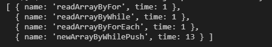
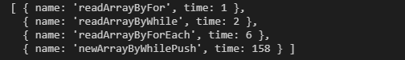
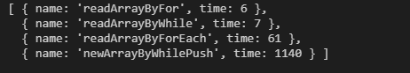

### Speed Test for read Array

- #### 5,0000

``` js
  let wl = newArrayByWhileLength(5e4)
```



- #### 50,0000

``` js
  let wl = newArrayByWhileLength(5e5)
```



- #### 500,0000

``` node
  node --max-old-space-size=2048 newArray.js
```

``` js
  let wl = newArrayByWhileLength(5e6)
```

